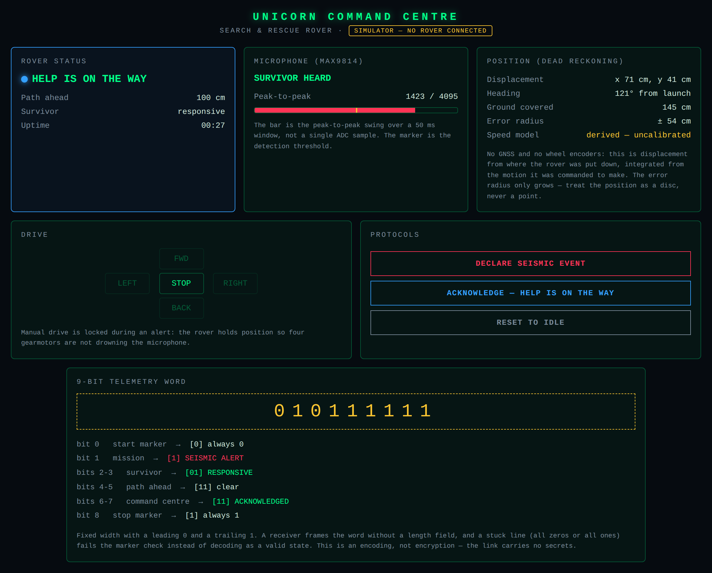
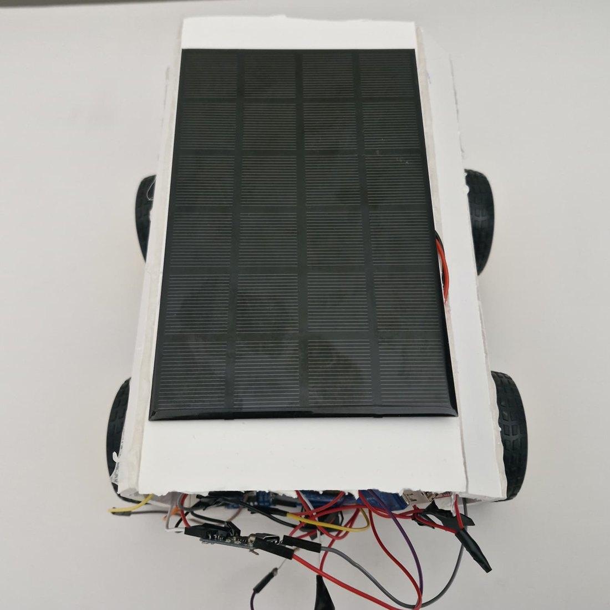
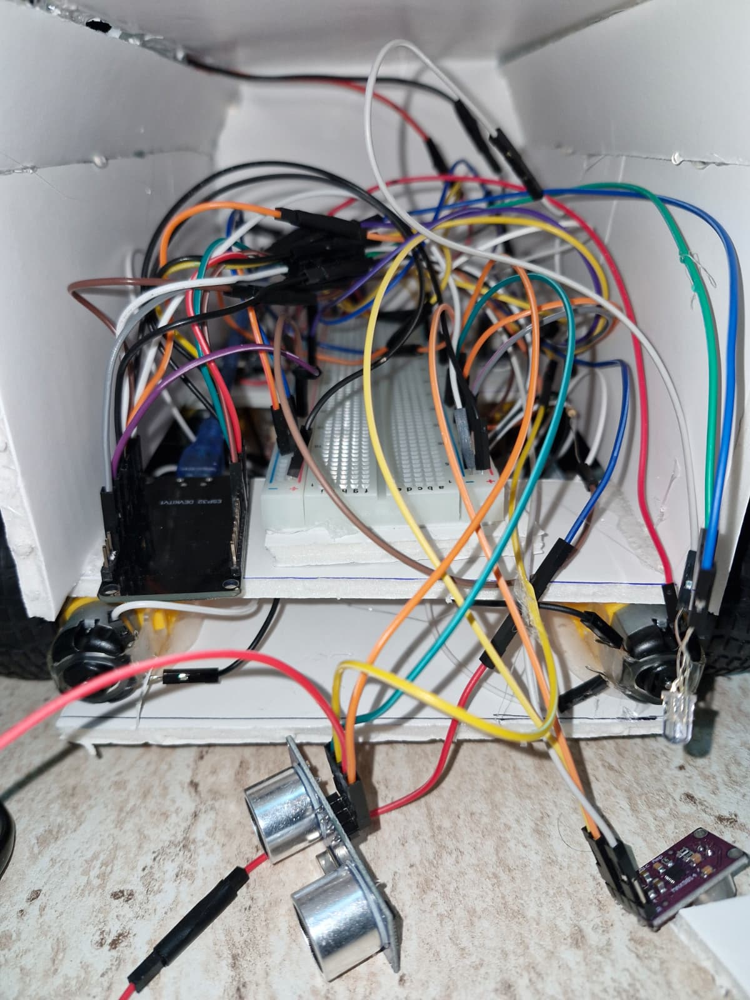

# Unicorn — Solar Search-and-Rescue Rover

**Version 2 · Completed**

A four-wheeled rover that raises its own Wi-Fi access point, serves a command-centre
page from the ESP32 itself, and listens for a survivor through a microphone. An
operator declares a seismic event, the rover sirens and listens, and once the centre
acknowledges, the rover switches its light from red to blue — so a person under debris
can see that they have been found.



| The rover | Under the shell |
|---|---|
|  |  |

---

## Try it without the rover

The robot is a one-off. The command centre is not:

```bash
python3 tools/simulator.py
```

Open `http://localhost:8000`. The simulator serves the same page and the same HTTP
interface as the ESP32, backed by a model of the rover: distance drifts as debris moves
through the beam, echoes occasionally time out, and a survivor answers a few seconds
after the alert.

Simulated data is never dressed up as real — every response carries
`"source": "simulator"` and the header reads **SIMULATOR — NO ROVER CONNECTED** in amber.

```bash
python3 tools/simulator.py --voice-delay 99   # nobody answers -> the SILENT path
python3 tools/simulator.py --voice-delay 0    # a survivor answers immediately
```

## The mission

| State | Light | What happens |
|---|---|---|
| **Idle** | magenta | Charging from the solar deck. The operator drives the rover manually. |
| **Alert** | red | The centre declares a seismic event. The rover holds position, sounds a 1200 Hz siren and listens. |
| **Located** | red → blue | A voice was heard, or the 15 s listening window closed with silence. Once the centre acknowledges, the light turns blue and the siren stops. |

The siren stops the moment a survivor is heard. A speaker screaming next to the
microphone is both useless — it masks the very sound the rover is listening for — and
unkind to the person underneath it.

## The 9-bit telemetry word

The rover reports its whole state as one fixed-width word:

```
0 1 01 11 00 1
│ │ │  │  │  └── bit 8     stop marker, always 1
│ │ │  │  └───── bits 6-7  command centre: 00 waiting, 11 acknowledged
│ │ │  └──────── bits 4-5  path ahead: 00 no echo, 01 blocked, 11 clear
│ │ └─────────── bits 2-3  survivor: 00 listening, 01 responsive, 10 silent
│ └───────────── bit 1     mission: 0 idle, 1 seismic alert
└─────────────── bit 0     start marker, always 0
```

Fixed width with start and stop markers means a receiver frames the word without a
length field, and a stuck line fails the marker check instead of decoding as a valid
state — `000000000` and `111111111` are both rejected. Undefined field codes (`11` for
the survivor, `10` for the path) are rejected too.

Nine bits carry the entire mission state, so the word is the rover's canonical
representation of itself: the panel decodes it, the tests assert it, and every other field
in the telemetry is auxiliary to it.

**It is an encoding, not encryption.** The link carries no secrets and there is no key.

## Position without GPS

An ESP32 has no GNSS radio, so there is no absolute fix to report and the firmware does
not invent one. What it can do is integrate the motion it commands: hold FORWARD for two
seconds at a known speed and you know roughly how far you went. That is dead reckoning —
position relative to the point of deployment.

The origin stays with the operator. The rover reports displacement in centimetres in its
own local frame; the command centre already knows where it put the robot down. Nothing
here has to invent a coordinate.

There are no wheel encoders, so the estimate rests on a nominal speed rather than on the
wheels actually turning. A stalled motor, a slipping wheel or a flat 18650 all make the
rover travel less than the model believes, and the error only ever grows. So the rover
reports the growth alongside the position: every reading comes with an error radius, and
the panel prints it as a disc, never a point.

The default speed is derived from the motor rating, the battery voltage, the bridge drop
and the wheel diameter — the arithmetic is in `config.h`. Derived is not measured, and the
firmware does not pretend otherwise: `SPEED_CALIBRATED` is 0 until someone drives the rover
a known distance and checks. While it is 0 the error radius grows more than twice as fast
and the panel labels the speed model **derived — uncalibrated**. A robot that knows how
much to trust itself is worth more than one that quietly reports a confident number.

## Engineering notes

**Loudness is swing, not level.**
A MAX9814 outputs an AC signal riding on a DC bias of roughly 1.25 V, so a single
`analogRead()` lands at an arbitrary point on the waveform: a shout sampled at a zero
crossing reads exactly the same as silence. Thresholding one sample cannot work, however
the threshold is chosen. The firmware tracks peak-to-peak amplitude across a 50 ms window
instead, the panel shows that swing live against the threshold, and there is a test for
precisely the hard case — a loud sound whose samples keep landing on the bias is still
detected.

**Three GPIOs the drive train must never touch.**
GPIO12 (MTDI) sets the flash voltage at reset, and an L298N input idles HIGH: put a motor
there and the ESP32 selects 1.8 V flash and does not start. GPIO0 and GPIO2 select the
boot mode, GPIO15 gates the boot log. None of them carries a motor or a sensor here. Every
pin the firmware touches is declared in `firmware/include/config.h`, so a conflict is one
file away rather than scattered through the source.

**An alert has to be reversible.**
A rescue rover that can only be armed once is not a rover. `/reset` returns it to idle,
clears the survivor state and re-declares its position.

**`pulseIn` blocks, so it runs at 10 Hz.**
The ultrasonic sensor is pinged ten times a second with a bounded timeout, rather than on
every pass of the loop where it would starve the web server. A lost echo is reported as
*no echo* — not folded into "path clear", which is a different claim entirely.

## Wiring

| Signal | GPIO | Notes |
|---|---|---|
| Red LED | 4 | 5 mm common-cathode RGB |
| Blue LED | 17 | red + blue together read as magenta = idle |
| Speaker | 33 | 8 R 0.5 W through a series resistor |
| Microphone | 34 | MAX9814 OUT — input-only pin, correct for the ADC |
| Ultrasonic trigger | 5 | HC-SR04 |
| Ultrasonic echo | 18 | HC-SR04 |
| Motor left forward | 26 | L298N IN1 |
| Motor left reverse | 13 | L298N IN2 |
| Motor right forward | 25 | L298N IN3 |
| Motor right reverse | 27 | L298N IN4 |

Avoided on purpose: **GPIO0, 2, 12, 15** (strapping pins).

## Hardware

- ESP32 dev board (30-pin, CP2102)
- L298N dual H-bridge, 4 × 6 V 250 RPM gearmotors
- HC-SR04 ultrasonic distance sensor
- MAX9814 microphone amplifier with automatic gain control
- 8 R 0.5 W speaker, 5 mm RGB LED
- 6 V 500 mA solar panel (110 × 175 mm), TP4056 charger, 5 V step-up, 2 × 18650 Li-ion
- AMS1117 3.3 V regulator, breadboard, foam-board chassis

The rover raises its own access point rather than joining a network: in a disaster there
is no router to join, so the command centre connects to the robot.

## Building and testing

**Firmware**

```bash
cd firmware
pio run -e fm-devkit -t upload
```

Join the Wi-Fi network `UNICORN_MERKEZ` and open `http://192.168.4.1`.

**Tests** — the mission logic in `lib/unicorn_core` has no Arduino dependency on purpose,
so it needs no toolchain, no board and no PlatformIO install to verify. A host compiler is
enough:

```bash
./tools/run_tests.sh
```

That runs three things: a type-check of `src/main.cpp` against the API stubs in
`tools/stubs`, 48 checks against the mission logic, and the Python cross-check of the
simulator's encoder. The stub compile catches syntax and signature errors without the
ESP32 toolchain; it is not a substitute for `pio run -e fm-devkit`. Inside PlatformIO the
unit tests also run as `pio test -e native`.

The simulator re-implements the telemetry word in Python so it can run without a
toolchain. Two implementations of one format is how a format quietly drifts, so both
test suites assert the same vectors.

**After editing the panel**

`panel/index.html` is the single source of truth for the UI. The simulator serves that
file directly; this bakes the same bytes into the PROGMEM string the ESP32 serves:

```bash
python3 tools/embed_page.py
```

## Project structure

```
firmware/include/config.h              pin map and tuning constants
firmware/include/web_page.h            generated - do not edit
firmware/src/main.cpp                  hardware, Wi-Fi, HTTP
firmware/lib/unicorn_core/             mission logic, no Arduino dependency
firmware/test/test_core/               native unit tests
panel/index.html                       command centre (source of truth)
tools/simulator.py                     the rover, without the rover
tools/embed_page.py                    panel -> PROGMEM
tools/test_simulator.py                cross-check against the firmware vectors
docs/                                  screenshots and build photos
```

## Scope

A course robot, not rescue equipment. It measures two things — distance ahead and how
loud the room is — and reports them honestly, including when it does not know.

## Author

Built by **Nisa Maaşoğlu**, Software Engineer — [github.com/nisamaasoglu](https://github.com/nisamaasoglu).
Source code available on request.

## License

MIT — see [LICENSE](LICENSE).
